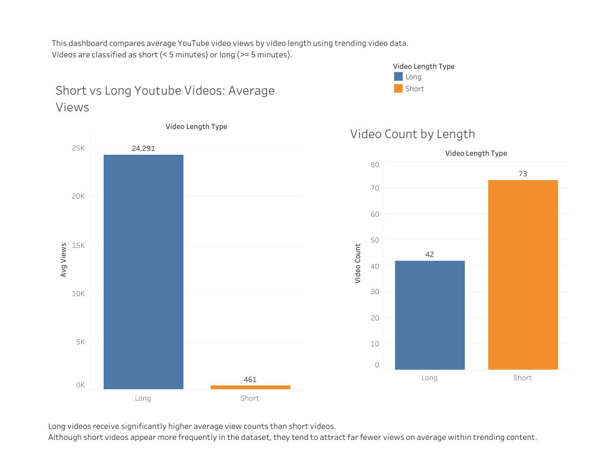

# Short vs Long YouTube Videos

## Overview
This project analyzes whether shorter YouTube videos consistently outperform longer videos in terms of views using trending video data.

## Tools Used
- SQL (PostgreSQL)
- Tableau Public
- GitHub

## Key Findings
- Long videos have significantly higher average views than short videos.
- Short videos appear more frequently in the dataset but receive fewer views on average.

## Visualization


## Tableau Public Link
https://public.tableau.com/app/profile/eliza.wanye/viz/short_vs_long_youtube_videos/Dashboard1

## SQL Query
```sql
SELECT 
    ROUND(AVG("viewCount")) AS avg_views,
    COUNT(*) AS video_count,
    CASE 
        WHEN "durationSec" < 300 THEN 'Short'
        ELSE 'Long'
    END AS video_length_type
FROM trending_videos_on_youtube_dataset
WHERE "viewCount" IS NOT NULL
GROUP BY video_length_type;

